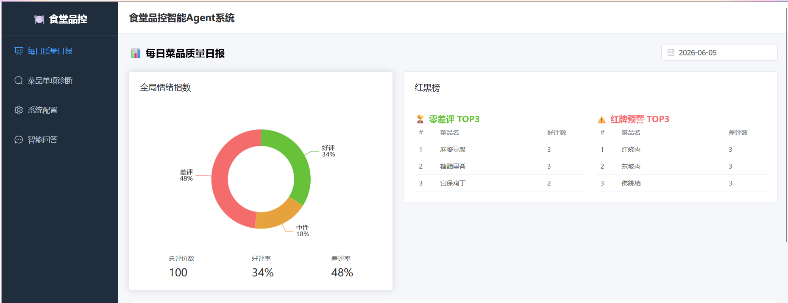
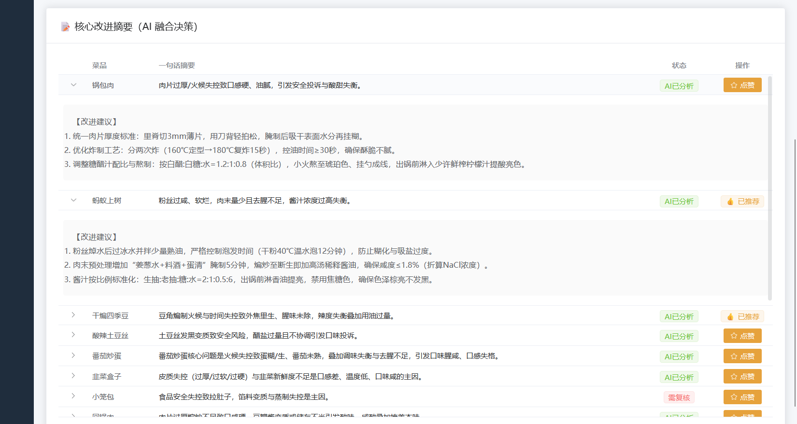
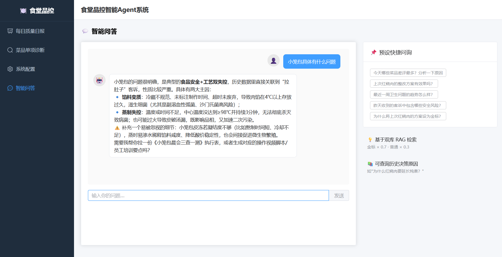
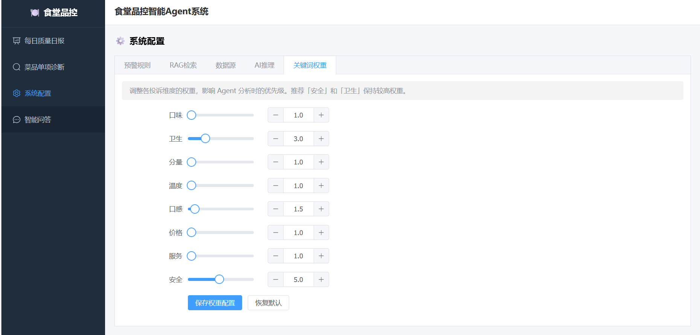

# 🍽️ 食堂品控智能 Agent 系统

基于 **LangGraph + Milvus + LLM** 的菜品质量智能分析平台，自动聚合顾客评价、生成 AI 改进建议，并通过向量库沉淀品控经验，形成自进化闭环。

---

## 🏗️ 架构总览

```
┌─────────────┐     ┌──────────────┐     ┌───────────────┐
│   Frontend   │────▶│   Backend     │────▶│    Agent       │
│  Vue 3 :3000 │     │ FastAPI :8000 │     │ FastAPI :8001  │
└─────────────┘     └──────┬───────┘     └───────┬───────┘
                           │                      │
                    ┌──────▼───────┐      ┌───────▼───────┐
                    │   RabbitMQ   │      │    Milvus     │
                    │  (Celery)    │      │  (向量库)     │
                    └──────┬───────┘      └───────────────┘
                           │
                    ┌──────▼───────┐
                    │    Redis     │
                    │  (任务队列)  │
                    └──────┬───────┘
                           │
                    ┌──────▼───────┐
                    │    MySQL     │
                    │  (业务数据)  │
                    └──────────────┘
```

| 组件 | 技术栈 |
|------|--------|
| 前端 | Vue 3 + Element Plus + ECharts |
| 后端 | FastAPI + SQLAlchemy + Celery |
| Agent | LangGraph + LangChain + Milvus |
| LLM | 阿里云 DashScope (qwen-plus) |
| Embedding | 阿里云 DashScope (text-embedding-v4) |
| 消息队列 | RabbitMQ + Redis |
| 数据库 | MySQL 8.0 |
| 向量库 | Milvus 2.4 (双集合: gold + standard) |

---

## 🚀 核心链路

```
CSV/Excel 导入
  │
  ├─ ① ETL 解析           → MySQL Review 表
  ├─ ② 情感分析            → 正面/负面/中性 + 菜品匹配
  ├─ ③ 菜品分组            → 按 dish_id 聚合
  ├─ ④ Redis 入队          → 批次任务队列
  └─ ⑤ Celery 下发         → RabbitMQ
        │
        └── [Celery Worker] 逐个消费
              │
              ├─ POST Agent /analyze_dish
              │     ├─ keyword_aggregation  → 关键词加权统计
              │     ├─ rag_reranked         → Milvus 双库检索
              │     └─ llm_fusion           → LLM 生成诊断
              │
              ├─ 写入 MySQL Diagnosis 表
              └─ 写入 Milvus standard_collection（经验沉淀）
```

**双库检索**：查询时同时搜索 `gold_collection`（金标经验，权重 0.7）和 `standard_collection`（普通经验，权重 0.3），加权排序后作为 LLM 上下文。

---

## 📸 界面预览

### 首页仪表盘


### AI 核心改进摘要


### 智能问答（RAG 检索）


### 关键词权重配置


---

## ⚡ 快速启动

### 1. 环境要求

- Python 3.11+
- Node.js 18+
- MySQL 8.0、Redis 7、RabbitMQ 3.12、Milvus 2.4（可部署在远程服务器，本项目默认指向 `192.168.10.20`）

### 2. 安装依赖

```bash
# 后端
cd backend
pip install -r requirements.txt

# Agent 微服务
cd ../agent
pip install -r requirements.txt

# 前端
cd ../frontend
npm install
```

### 3. 配置环境变量

复制 `.env.example` 为 `.env`，修改数据库/Redis/RabbitMQ/Milvus 连接地址和 LLM API Key。

### 4. 初始化数据库和 Milvus

```bash
# 启动 Backend 自动建表（首次启动）
cd backend
uvicorn app.main:app --port 8000

# 创建 Milvus 向量集合（仅需一次）
cd ../agent
python init_milvus.py
```

### 5. 启动全部服务（4 个终端）

```powershell
# 终端 1: Backend
cd backend
uvicorn app.main:app --host 0.0.0.0 --port 8000 --reload

# 终端 2: Agent 微服务
cd agent
uvicorn app.main:app --host 0.0.0.0 --port 8001 --reload

# 终端 3: Celery Worker（Windows 必须加 --pool=solo）
cd backend
celery -A app.tasks.celery_app worker --loglevel=info --pool=solo

# 终端 4: 前端
cd frontend
npm run dev
```

访问 http://localhost:3000 进入系统。

---

## 📊 功能模块

| 模块 | 路径 | 说明 |
|------|------|------|
| 首页仪表盘 | `/` | 全局情绪指数饼图、红黑榜 TOP3、AI 改进摘要表 |
| 菜品详情 | `/dish/:id` | 单菜品评价趋势 & AI 诊断报告 |
| 数据导入 | `/agent` 页面上传 | 两段式：预览 → 勾选 → 确认 → 自动入队分析 |
| 智能问答 | `/chat` | 基于 Milvus 双库 RAG 的品控对话 |
| 系统配置 | `/agent` 页面配置 | 敏感词、RAG 参数、关键词权重 |

---

## 🔧 Windows 注意事项

- Celery Worker 必须加 `--pool=solo`，Windows 不支持 prefork
- 路径用反斜杠 `\` 或正斜杠 `/` 均可
- 远程服务（MySQL/Redis/RabbitMQ/Milvus）确保防火墙已放行对应端口

---

## 🐳 Docker 部署

```bash
docker-compose up -d
```

包含全部服务：MySQL、Redis、RabbitMQ、Milvus、Backend、Celery Worker、Celery Beat、Agent、Frontend。

---

## 📁 项目结构

```
canteen-agent/
├── agent/                  # Agent 微服务 (LangGraph + Milvus)
│   ├── app/
│   │   ├── nodes/          # 工作流节点 (keyword / rag / llm)
│   │   ├── prompts/        # LLM Prompt 模板
│   │   ├── utils/          # Milvus 连接 / LLM 工具
│   │   └── workflow.py     # LangGraph 工作流编排
│   └── init_milvus.py      # Milvus 集合初始化脚本
├── backend/                # 主后端 (FastAPI)
│   └── app/
│       ├── api/v1/         # REST API (dashboard / dishes / chat / upload / config)
│       ├── models/         # SQLAlchemy ORM 模型
│       ├── services/       # ETL + 评价处理
│       └── tasks/          # Celery 任务 + Redis 队列
├── frontend/               # Vue 3 前端
│   └── src/
│       ├── views/          # 页面组件
│       ├── api/            # API 封装
│       └── stores/         # Pinia 状态管理
├── scripts/                # 种子数据 / SQL
├── picture/                # 项目截图
├── docker-compose.yml      # Docker 编排
└── .env                    # 环境变量
```
